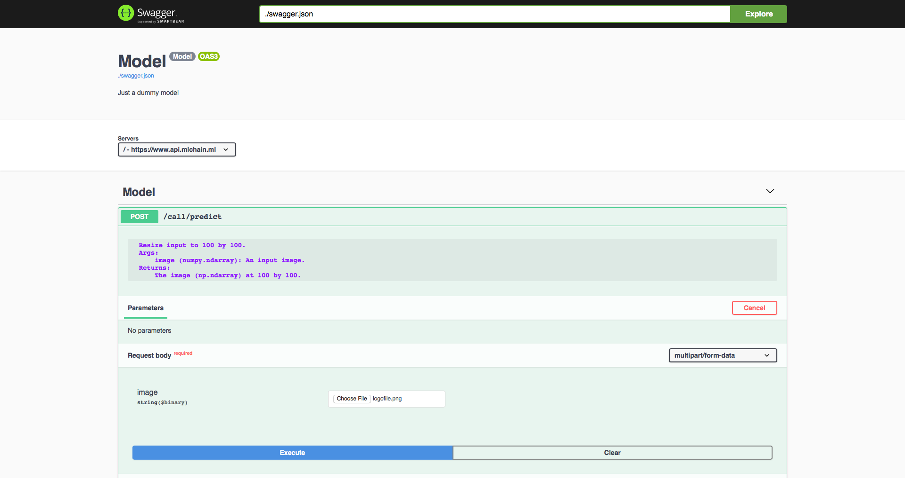

<p align="center">
  <a href="https://mlchain.ml" target="_blank">
    
  </a><br><br>
  <i> <strong>MLChain:</strong> Auto-Magical Deploy AI model at large scale, high performance, and easy to use </i> <br>
  <a href="https://mlchain.readthedocs.io/en/latest/?" target="_blank">
  <br>
    <strong> Explore the docs » </strong>
  </a> <br>
  <a href="https://mlchain.ml" target="_blank"> Our Website </a>
    ·
  <a href="https://github.com/techainer/examples-python" target="_blank"> Examples in Python </a>
</p>


[](https://badge.fury.io/py/mlchain)
[](https://pepy.tech/project/mlchain)
[](https://github.com/Techainer/mlchain-python/actions/workflows/ci.yml)
[](https://codecov.io/gh/Techainer/mlchain-python)
[](https://mlchain.readthedocs.io/en/latest/?badge=latest)
[](https://github.com/Techainer/mlchain-python/blob/master/LICENSE)
</div>


MLChain is a simple, easy to use library that allows you to deploy your Machine Learning
model to hosting server easily and efficiently, drastically reducing the time required 
to build API that support an end-to-end AI product.

## Key features

- <b> Fast: </b> MLChain prioritize speed above other criteria.

- <b> Fast to code: </b> With a finished Machine Learning model, it takes 4 minutes on average 
  to deploy a fully functioning API with MLChain.

- <b> Flexible: </b> The nature of ML-Chain allows developing end-to-end adaptive, with 
  varied serializer and framework hosting at your choice.

- <b> Less debugging </b>: We get it. Humans make mistakes. With MLChain, its configuration makes debugging a lot easier and almost unnecessary.

- <b> Easy to code: </b> as a piece of cake!

- <b> Standards-based: </b> Based on the open standards for APIs: OpenAPI (previously known as Swagger), along with JSON Schema and other options.


## Installation

MLChain required Python 3.6 and above

### PyPI
To install latest stable version of MLChain, simply run:
```bash
pip install mlchain
```


### Build from source
If you can't wait for the next release, install the most up to date code with from `master` branch by running the following command:
```bash
git clone https://github.com/Techainer/mlchain-python
cd mlchain-python
pip install -r requirements.txt
python setup.py install
```
Or simply install using git:
```bash
pip install git+https://github.com/Techainer/mlchain-python@master --upgrade
```

## Documentation
Read ours documentation [here](https://mlchain.readthedocs.io/en/latest/?)


## Demo
Here's a minimal example of serving a dummy python class

Create a `server.py` file:

```python
import cv2
import numpy as np
from mlchain.base import ServeModel


class Model():
  """ Just a dummy model """

  def predict(self, image: np.ndarray):
      """
      Resize input to 100 by 100.
      Args:
          image (numpy.ndarray): An input image.
      Returns:
          The image (np.ndarray) at 100 by 100.
      """
      image = cv2.resize(image, (100, 100))
      return image


# Define model
model = Model()

# Serve model
serve_model = ServeModel(model)

# Deploy model
if __name__ == '__main__':
    from mlchain.server import FlaskServer
    # Run flask model with upto 12 threads
    FlaskServer(serve_model).run(port=5000, threads=12)
```
Now run:

```bash
python server.py
```

And you should see something like this:
```console
[mlchain-logger]:[7895] [2020-08-18 09:53:02 +0700]-[INFO]-[flask_server.py:424]---------------------------------------------------------------------------------
[mlchain-logger]:[7895] [2020-08-18 09:53:02 +0700]-[INFO]-[flask_server.py:425]-Served model with Flask at host=127.0.0.1, port=5000
[mlchain-logger]:[7895] [2020-08-18 09:53:02 +0700]-[INFO]-[flask_server.py:426]-Debug = False
[mlchain-logger]:[7895] [2020-08-18 09:53:02 +0700]-[INFO]-[flask_server.py:427]---------------------------------------------------------------------------------
```

Now you can access your API at http://localhost:5000

You can open Swagger UI at http://localhost:5000/swagger and try your API out right away



After explore all your API endpoint over there, create a `client.py` file:
```python
import numpy as np
from mlchain.client import Client

model = Client(api_address='http://localhost:5000').model()
# Create a dummy input with shape (200, 200)
input_image = np.ones((200, 200), dtype=np.uint8)
# Then pass it through our client just like normal Python
result_image = model.predict(input_image)
print(result_image.shape)  # And the result should be (100, 100)
```
Now you have a supper simple `Client` to work with. Sooo easy :D

## Examples
- Serving MNIST using MLchain: https://github.com/Techainer/mnist-mlchain-examples

## Asking for help
Welcome to the MLChain community!

If you have any questions, please feel free to:
1. [Read the docs](https://mlchain.readthedocs.io/en/latest/?)
2. [Open an issues](https://github.com/Techainer/mlchain-python/issues/new)

We are happy to help