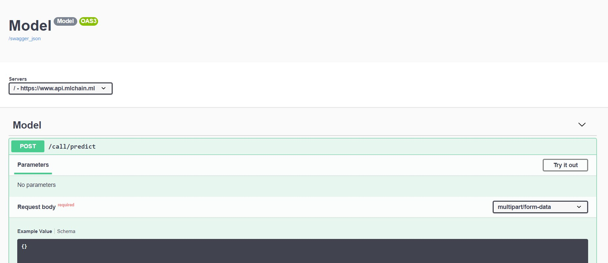

## Deploy an API

The simplest ML-Chain file <b> (main.py) </b> can look like this:

```python
from mlchain.base import ServeModel
# define model
class Model():
    def __init__(self):
        self.ans = 'Hello World'

    def predict(self):
        return self.ans

# create instance
model = Model()

# deploy it
serve_model = ServeModel(model)
```

Run the live server:
```bash
mlchain run --host 127.0.0.1 --port 5000 main.py
```

and your api will be deployed on http://127.0.0.1:5000.

Or you can use <b> mlconfig.yml </b> file for more customization

```bash
mlchain init
```

This will create the <b> mlconfig.yml </b> file, which you can customize as you wanted.

After that, run

```bash
mlchain run
```

and your API will be deployed.

## Test your API

Access http://127.0.0.1:5000 (or your modified host and port)


Click on <b>Swagger </b> on top right of the page



Click "Try It out" and "Execute" to test the program. You will get "Hello World" as the response.


## Step by step explaination

First, we import the ServeModel class from ML-Chain

```python
# import our ServeModel function
from mlchain.base import ServeModel
```

Next, we define our model with its acompanying function. Here, our model 
simply has to always predict "hello world". In real use cases, our model can take in 
more complex input, such as an image, and make prediction based on that input.

```python
class Model():
    def __init__(self):
        self.ans = 'Hello World'

    def predict(self):
        return self.ans

# create instance
model = Model()
```

Deploy our model. Here, our ServeModel function takes in our model and deploy it.

```python
# deploy it
serve_model = ServeModel(model)
```

Our terminal code include the identification that we are running mlchain, along with 
parameters including our host (127.0.0.1), our port (5000), and the file to run (main.py)

```bash
mlchain run --host 127.0.0.1 --port 5000 main.py
```