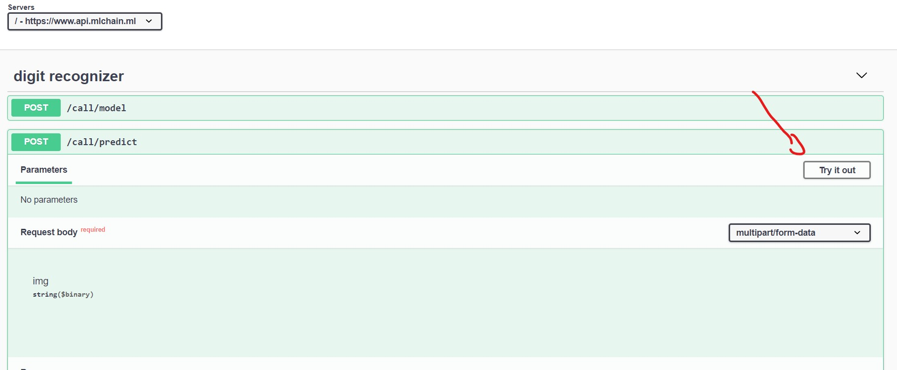
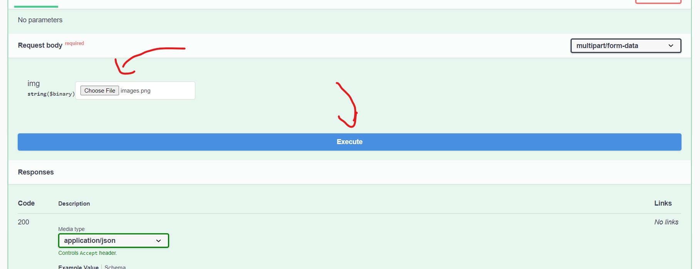
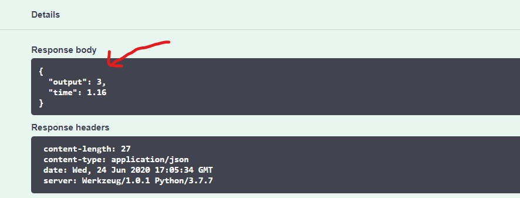

# Building a Pytorch API with MLChain

In this tutorial, we will build a Pytorch model on the MNIST dataset and deploy it using ML-Chain. If you are already 
familiar with Pytorch, you can simply download the Pytorch model <b> [here](https://drive.google.com/file/d/1BT4ZUeYVTMAkxz_XMkJ_9RyL69d26I6m/view?usp=sharing) </b> and skip to section 2 in this tutorial. 
Otherwise, let's get started. 

## 1. Building a MNIST classifier using Pytorch

In this step, we will build a simple classifier using Pytorch as our framework. For the sake of simplicity, 
our model will be composed of a simple network with 2 hidden, fully-connected layers, along with a final layer.
Fully connected layers use all the input from the previous layer to create new output, which is subsequently used as input
for the next model. 

First, create a <b> train.py </b> file and import the necessary libraries:

```python
from torchvision import transforms, datasets
import torch
from torch import nn, optim, utils
import torch.nn.functional as F
import numpy as np
from tqdm import tqdm
```

Next, we will have to define the transformation that each images goes through after it is loaded into our program.
This include first changing the image input into a Tensor() object, which is the standard object in deep learning.
We will also normalize the image input with a mean of 0.5 and a standard deviation of 0.5.

```python
# define transformation
transform = transforms.Compose([transforms.ToTensor(),
                                transforms.Normalize([0.5], [0.5])
])
```

Downloading and loading our data into Pytorch. Here, we first download our train set and test set from torchvision.datasets, 
then we subsequently put them into pytorch's DataLoader, which is used to store our data and train the model.

```python
# getting our data
train_set = datasets.MNIST('/files/', train=True, download=True, transform = transform)
test_set = datasets.MNIST('/files/', train=False, download=True, transform = transform)

# loading our data
train_loader = utils.data.DataLoader(train_set, batch_size = 64, shuffle = True)
test_loader = utils.data.DataLoader(test_set, batch_size = 64, shuffle = True)
```

Let's now define our model. Here, we will use a simple model with 2 hidden, fully connected layer. They are passed 
through ReLU activation functions, until passing through the last output layer, where the log-softmax activation function is
applied. 

```python
model = nn.Sequential(nn.Flatten(),
                      nn.Linear(784, 256),
                      nn.ReLU(),
                      nn.Linear(256, 128),
                      nn.ReLU(),
                      nn.Linear(128,10),
                      nn.LogSoftmax())
```

With our model already done, we simply have to decide whether we want to train our model on CPU or GPU.
GPU generally drastically increase time in training a model, but isn't always available. CPU, on the other hand, 
are always readily available. However, they are much slower in training in comparision with GPU.

```python
# Find the device available to use using torch library
device = torch.device("cuda" if torch.cuda.is_available() else "cpu")
# Move model to the device specified above
model.to(device)
```

For this model, we will use the NLLLoss() function along with Adam optimizer, with a learning rate of 0.001. By using Adam 
optimizer, our model will converse pretty fast and we should see good results in no time.

```python
# Set the error function using torch.nn as nn library
criterion = nn.NLLLoss()

# Set the optimizer function using torch.optim as optim library
optimizer = optim.Adam(model.parameters(), lr=0.001)
```

Finally, let's start training. In the following code, we are running on 20 epochs. With each epochs, we train 
on the train_loader while evaluating on the test_loader. Model with the lowest test_loss is saved after each iteration.

```python
#actual training
epochs = 20
min_test_loss = np.inf
for epoch in range(epochs):
    train_loss = 0
    test_loss = 0
    accuracy = 0

    # Training the model
    model.train()
    for inputs, labels in tqdm(train_loader):
        # Move to device
        inputs, labels = inputs.to(device), labels.to(device)
        # Clear optimizers
        optimizer.zero_grad()
        # Forward pass
        output = model.forward(inputs)
        # Loss
        loss = criterion(output, labels)
        # Calculate gradients (backpropogation)
        loss.backward()
        # Adjust parameters based on gradients
        optimizer.step()
        # Add the loss to the training set's rnning loss
        train_loss += loss.item() * inputs.size(0)

    # Evaluating the model
    model.eval()
    # Tell torch not to calculate gradients
    with torch.no_grad():
        for inputs, labels in tqdm(test_loader):
            # Move to device
            inputs, labels = inputs.to(device), labels.to(device)
            # Forward pass
            output = model.forward(inputs)
            # Calculate Loss
            testloss = criterion(output, labels)
            # Add loss to the validation set's running loss
            test_loss += testloss.item() * inputs.size(0)

            # Since our model outputs a LogSoftmax, find the real
            # percentages by reversing the log function
            output = torch.exp(output)
            # Get the top class of the output
            top_p, top_class = output.topk(1, dim=1)
            # See how many of the classes were correct?
            equals = top_class == labels.view(*top_class.shape)
            # Calculate the mean (get the accuracy for this batch)
            # and add it to the running accuracy for this epoch
            accuracy += torch.mean(equals.type(torch.FloatTensor)).item()

            # Get the average loss for the entire epoch
    train_loss = train_loss / len(train_loader.dataset)
    test_loss = test_loss / len(test_loader.dataset)
    # saving the model with the lowest test_loss
    if test_loss < min_test_loss:
        min_test_loss = test_loss
        print("Lowest Loss Achieved! Saving our model")
        torch.save(model, 'model.pth')
    # Print out the information
    print('Accuracy: ', accuracy / len(test_loader))
    print('Epoch: {} \tTraining Loss: {:.6f} \tValidation Loss: {:.6f}'.format(epoch, train_loss, test_loss))
```
Run the program in your terminal with ```python train.py```.
You should now find a file called "model.pth". This will be used for our main API!

## 2. Applying ML-Chain

Whether you followed the first step or not, you should now have a <b> model.pth </b> file ready for running. If
not, please download it here: https://drive.google.com/file/d/1BT4ZUeYVTMAkxz_XMkJ_9RyL69d26I6m/view?usp=sharing.
In the same folder where you stored the <i> model.pth </i> file, create a <b> main.py </b> file and include the following libraries:

```python
import torch
from torch import load
from torchvision import transforms
import numpy as np
from PIL import Image

# mlchain library
from mlchain.base import ServeModel
```

Next, we load our model into the program. To use mlchain, we will have to create
a class serving this particular purpose. Create the following class with the init function

```python
class Model():
    def __init__(self):
        # load our model
        self.model = load('model.pth')

        # run on cpu
        self.model.to('cpu')
```

Next, we need to define a transformation for input images. Since this model was trained on 
the MNIST dataset with size 28x28 and only 1 color channel, we will have to resize any 
input image to this size along with turning them into grayscale. On top of that, we 
need to put them into Tensor, along with normalizing the input.

```python
# define transformation for input images
self.transform = transforms.Compose([transforms.Grayscale(num_output_channels=1),
                                     transforms.Resize(28),
                                     transforms.ToTensor(),
                                     transforms.Normalize((0.5,), (0.5,))])
```

Our model will serve one specific purpose: <b> predict</b>. With any image put through 
the input, we will try to predict the corresponding digit to that image. Let's now define our 
predict function. 

```python
def predict(self, img:np.ndarray):
    # predict the class our image belongs to

    # form an PIL instance from img
    img = Image.fromarray(img)

    # transform image using our defined transformation
    img = self.transform(img)

    # reshape image into 4 - dimensions. This is the standard to 
    # put in Pytorch model.
    img = img.view(1, img.shape[0], img.shape[1], img.shape[2])

    # predict class using our model
    with torch.no_grad():
        # forward function
        preds = self.model(img)

        # get maximun value
        pred = np.argmax(preds, axis=1)

    # return our final result (predicted number)
    return int(pred)
```

Putting it together:

```python
class Model():
    def __init__(self):
        # load our model
        self.model = load('model.pth')

        # run on cpu
        self.model.to('cpu')

        # define transformation for input images
        self.transform = transforms.Compose([transforms.Grayscale(num_output_channels=1),
                                             transforms.Resize(28),
                                             transforms.ToTensor(),
                                             transforms.Normalize((0.5,), (0.5,))])

    def predict(self, img:np.ndarray):
        # predict the class our image belongs to

        # form an PIL instance from Image
        img = Image.fromarray(img)

        # transform image using our defined transformation
        img = self.transform(img)

        # reshape image into 4 - dimensions
        img = img.view(1, img.shape[0], img.shape[1], img.shape[2])

        # predict class using our model
        with torch.no_grad():
            # forward function
            preds = self.model(img)

            # get maximun value
            pred = np.argmax(preds, axis=1)

        # return our final result (predicted number)
        return int(pred)
```

Phew! Now that the challenging part is done, we can now deploy our model.
Add the following code under our defined model.

```python
# define model
model = Model()

# serve model
ServeModel(model)
```

And that's pretty much it. You don't have to build a brand new app from flask, no
routing, creating HTML form, or any thing of that instance. MLChain's got you covered.

Run the program:
```python
mlchain run --host localhost --port 5000 main.py
```

Now, go to http://localhost:5000 to test out your API. Click on the top right corner 
to access swagger.


Click on "Try It Out" on our predict function.



Upload our image, then click Execute:



See your output!

