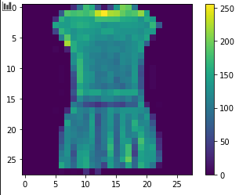
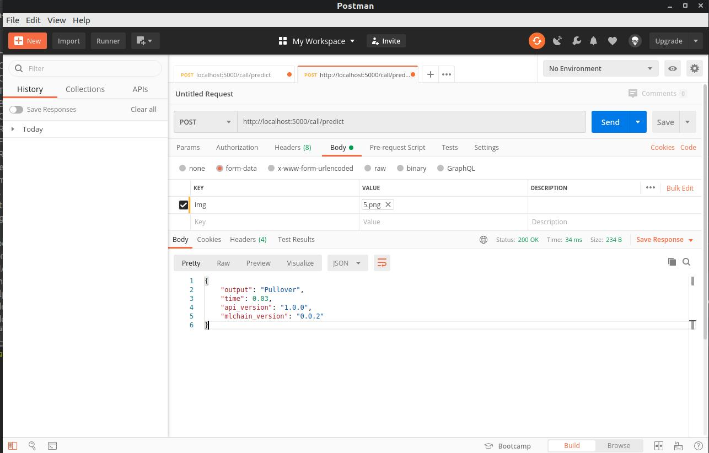
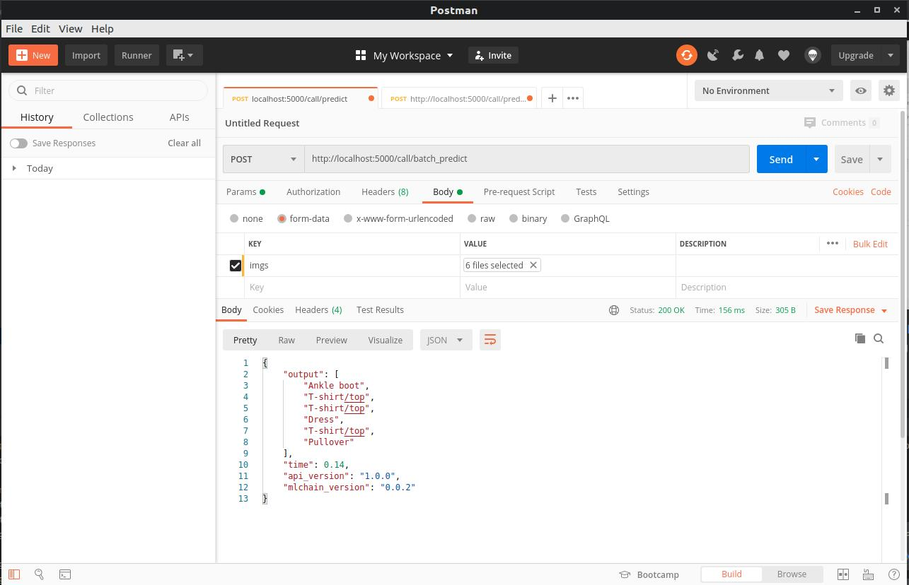

# Building a Keras API with MLChain

In this tutorial, we will build a Keras model on the Fashion-MNIST dataset and deploy it using ML-Chain. If you are already familiar with Keras, you can simply download the Keras model <b> [here](https://drive.google.com/file/d/1z-AK8Ld3krtxYh9FPWDQb2x1ZXdZyow2/view?usp=sharing) </b> and skip to section 2 in this tutorial. 

Otherwise, let's get started. 

## 1. Building a Fashion-MNIST classifier using Keras

In this section, we will build a simple Keras model using Jupyter notebook. After saving the model, we will use it and deploy an API using MLChain. 

First, start your Jupyter Notebook and import the necessary libraries. For this version, I'm using tensorflow 2.2.0 for our keras model.

```python
# TensorFlow and tf.keras
import tensorflow as tf
from tensorflow import keras

# Helper libraries
import numpy as np
import matplotlib.pyplot as plt
```

Next, let's load our dataset into our notebook. In this step, we first download the fashion_mnist data from the keras.datasets library. Next, we load them with load_data(), and finally assign the class names.

```python
# get the FASHION-MNIST data
fashion_mnist = keras.datasets.fashion_mnist

# load train 
(train_images, train_labels), (test_images, test_labels) = fashion_mnist.load_data()

# list the classes
class_names = ['T-shirt/top', 'Trouser', 'Pullover', 'Dress', 'Coat', 'Sandal', 'Shirt', 'Sneaker', 'Bag', 'Ankle boot']
```

Next, let's display some images:

```python
plt.figure()
plt.imshow(train_images[3])
plt.colorbar()
plt.grid(False)
plt.show()
```



To improve our model's performance, we should also convert our data to a scale from 0 - 1 as input.
This is because pixel data are represented for a scale from 0 to 255. Since these number are quite large, the model
will find more difficulty converging. Normalizing them to a scale between 0 and 1 can lead to faster convergence. 

```python
train_images = train_images / 255.0
test_images = test_images / 255.0
```

In this tutorial, we will be adding a convolution layer in our dataset. For this reason, we will
have to reshape our input data shape. Convolution layers take in input images with 4 dimensions <i> (batch_size, height, width, no. of channels)</i>,
and perform subsequent operations on them. Since we have batches of images of size 28x28, with only 1 channel, we reshape them
into the following dimension: (batch_size, 28, 28, 1).

The following code complete this task:

```python
train_images = train_images.reshape(train_images.shape[0], train_images.shape[1], train_images.shape[2], 1)
test_images = test_images.reshape(test_images.shape[0], test_images.shape[1], test_images.shape[2], 1)
```

Next, we define our model structure. This includes first a convolution layer with a 32 output layers, 
with a kernel size of 3, followed by a relu activation funtion. After that, our model is flattened, then
and applied a dropout layer with 25% probability. This dropout layer will turn some hidden layer's values to 0,
and reduce overfitting in our model. Next, a fully connected layer with 128 output nodes is applied, followed by
the relu activation function. A final dropout layer of probability 25% is applied, and a fully connected layer 
of 10 output is applied, corresponding to our 10 classes.

```python
model = keras.Sequential([
    keras.layers.Conv2D(32, kernel_size=3, activation='relu', input_shape=(28,28,1)),
    keras.layers.Flatten(),
    keras.layers.Dropout(0.25),
    keras.layers.Dense(128, activation='relu'),
    keras.layers.Dropout(0.25),
    keras.layers.Dense(10)
])
```                                            

Lastly, let's define our optimizer, loss function, and evaluation metrics. We will use the Adam optimizer, Cross-Entropy loss, and
accuracy as our main metric.

```python
model.compile(optimizer='adam',
              loss=tf.keras.losses.SparseCategoricalCrossentropy(from_logits=True),
              metrics=['accuracy'])
```             

Let's run our model:

```python
model.fit(train_images, train_labels, epochs=15)
```

Check the log for training progress. We should see our loss steadily decreasing and our accuracy steadily increasing.

```bash
Train on 60000 samples
Epoch 1/15
60000/60000 [==============================] - 7s 122us/sample - loss: 0.4203 - accuracy: 0.8491
Epoch 2/15
60000/60000 [==============================] - 6s 99us/sample - loss: 0.2892 - accuracy: 0.8945
Epoch 3/15
60000/60000 [==============================] - 6s 97us/sample - loss: 0.2437 - accuracy: 0.9095
Epoch 4/15
60000/60000 [==============================] - 6s 97us/sample - loss: 0.2098 - accuracy: 0.9216
Epoch 5/15
60000/60000 [==============================] - 6s 100us/sample - loss: 0.1834 - accuracy: 0.9307
Epoch 6/15
60000/60000 [==============================] - 6s 100us/sample - loss: 0.1637 - accuracy: 0.9390
Epoch 7/15
60000/60000 [==============================] - 6s 99us/sample - loss: 0.1477 - accuracy: 0.9443
Epoch 8/15
60000/60000 [==============================] - 6s 100us/sample - loss: 0.1319 - accuracy: 0.9501
Epoch 9/15
60000/60000 [==============================] - 6s 99us/sample - loss: 0.1191 - accuracy: 0.9550
Epoch 10/15
60000/60000 [==============================] - 6s 100us/sample - loss: 0.1092 - accuracy: 0.9584
Epoch 11/15
60000/60000 [==============================] - 6s 100us/sample - loss: 0.1013 - accuracy: 0.9616
Epoch 12/15
60000/60000 [==============================] - 6s 101us/sample - loss: 0.0902 - accuracy: 0.9647
Epoch 13/15
60000/60000 [==============================] - 6s 100us/sample - loss: 0.0863 - accuracy: 0.9671
Epoch 14/15
60000/60000 [==============================] - 6s 99us/sample - loss: 0.0805 - accuracy: 0.9692
Epoch 15/15
60000/60000 [==============================] - 6s 100us/sample - loss: 0.0776 - accuracy: 0.9712
```                                                                         

Our model return a loss of 0.0776 on the training set, with an accuracy of upto 97.12%. We will need to test on 
the test set to determine its actual ability in generalizing to new dataset.

```python
test_loss, test_acc = model.evaluate(test_images,  test_labels, verbose=2)

print('Test loss: ', test_loss)
print('\nTest accuracy: ', test_acc)
```                                

Since our model is testing on an entirely different dataset, it indeed performs somewhat more poorly in comparision 
with the training dataset. The loss is at 0.37, while the accuracy is at 90%. This is an example of overfitting.

```bash
10000/1 - 1s - loss: 0.4749 - accuracy: 0.9095
Test loss:  0.37909149531126024

Test accuracy:  0.9095           
```                               

We could have employed some strategies, such as early stopping and training the training set on a smaller dataset. 
However, now that we're trying to use mlchain to deploy our API, let's save the model and deploy it only for actual
use cases. 

```python
# save model
model_json = model.to_json()
with open("model.json", "w") as json_file:
    json_file.write(model_json)
# serialize weights to HDF5
model.save_weights("model.h5")
print("Saved model to disk")
```                

## 2. Using MLChain to deploy our model

Regardless of whether you decided to follow step 1 or not, you should now have a <b> model.h5 </b> and a 
<b> model.json </b> file that allows you to deploy your Keras model. If you haven't downloaded these files yet, get
them here: https://drive.google.com/file/d/1z-AK8Ld3krtxYh9FPWDQb2x1ZXdZyow2/view?usp=sharing

In the same folder, create a <b> main.py </b> file. This will be where we deploy our model. 
Import the necessary libraries

```python
# helper libraries
import tensorflow as tf
from tensorflow import keras
import numpy as np
from tensorflow.keras.models import model_from_json
import cv2

# mlchain libraries
from mlchain.base import ServeModel
```                

Next, we load our model into the program. To use mlchain, we will have to create
a class serving this particular purpose. Create the following class with the init function.

```python
class Model():
    # define and load our prior model
    def __init__(self):

        # load model
        # load json and create model
        json_file = open('../model.json', 'r')
        loaded_model_json = json_file.read()
        json_file.close()
        self.model = model_from_json(loaded_model_json)

        # load weights into new model
        self.model.load_weights("../model.h5")

        # list of class names
        self.class_names = ['T-shirt/top', 'Trouser', 'Pullover', 'Dress', 'Coat',
                       'Sandal', 'Shirt', 'Sneaker', 'Bag', 'Ankle boot']
```

In the above code, we load our model from the json file and subsequently the weights from the h5 file.
In addition, we define the class_names that will allow us to distinguish between different class
output. 

Our model will serve one specific purpose: <b> predicting </b>. With any image put through 
the input, we will try to predict the corresponding digit to that image. Let's now define our 
predict function. 

```python
# define function for predicting images
def predict(self, img:np.ndarray):
    r"""
    Predict classes that image is based in
    Args:
        img(numpy array): Return an image used for prediction

    Note: You don't have to worry about the input for this function. Most of the time
    the input img:np.ndarray would be sufficient. It's important how you work with that input.
    """
    # convert color
    img = cv2.cvtColor(img, cv2.COLOR_BGR2GRAY)

    # predict
    predict = self.model.predict(img.reshape(1, 28, 28, 1))

    # get class num
    predict_index = np.argmax(predict)

    # return class name
    return self.class_names[predict_index]
```                                    

We also might want to predict multiple images, rather than just one. Create another function 
which take a list of images, and make predictions based on those images.

```python
def batch_predict(self, imgs:List(np.ndarray)):
    ans = []
    for img in imgs:
        ans.append(self.predict(img))
    return ans
```           

Lastly, we deploy our model with 2 lines of codes:

```python
# define model
model = Model()

# serve model
serve_model = ServeModel(model)
```

To deploy our model, we first run `mlchain init`. This should result in a yaml file.

We modify the parameters (name, entry_file, and port) to get the following file: 

```yaml
name: Fashion-MNIST classifier # name of service
entry_file: main.py # python file contains object ServeModel
host: localhost # host service
port: 5000 # port service
server: flask # option flask or quart or grpc
wrapper: None # option None or gunicorn or hypercorn
cors: true
dump_request: None # None or path folder log request
version: '1.0.0'
api_keys: None
#  - key1
#  - key2
gunicorn: # config apm-server if uses gunicorn wrapper
  timeout: 60
  keepalive: 60
  max_requests: 0
  threads: 10
  worker_class: 'gthread'
  umask: '0'
hypercorn: # config apm-server if uses hypercorn wrapper
  keep_alive_timeout: 60
  worker_class: 'asyncio'
  umask: 0

mode:
  default: dev  # running mode
  env:   # set of mode env
    default: {}   # environ default
    dev: {} # environ by mode
    prod: {} # environ by mode
```                       

Next, run `mlchain run` and go to http://localhost:5000 to test our your API. Alternatively, you
can also test out our request with Postman.

The following POST request to http://localhost:5000/call/predict with a img param get us the subsequent response.


Similarly, a similar request to http://localhost:5000/call/batch_predict with imgs param including multiple 
images returns the following:



## 3. Communicating with MLChain

Now that we have had our model deployed, we can use MLChain Client to communicate between multiple programs.

In a separate folder, create a <b> client.py </b> file. Import the necessary libraries:

```python
from mlchain.client import Client
import cv2
```

Next, we will "import" our model that is already deployed on the web. 

```python
model = Client(api_address='127.0.0.1:5000', serializer='msgpack').model(check_status=False)
```

In the above code, we are using the model that is deployed on 127.0.0.1:5000. We also identified the 
serializer, in which our model will return data in message pack. 

At this point, it takes 3 lines to get our model working. Simply by identifying the files,
we run batch predict to get the response of all the files.

```python
# list the file to run classifier
files = ['data/1.png', 'data/2.png', 'data/3.png'] # TODO: list of files you want to process
imgs = [cv2.imread(i) for i in files]
# get our result
print(model.batch_predict(imgs))
```

We get the following as our response:

```bash
['T-shirt/top', 'T-shirt/top', 'Dress']
```