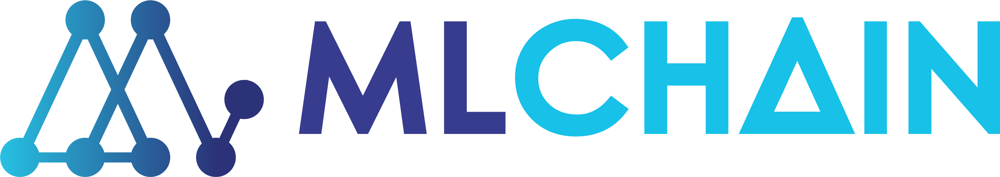

<p align="center">
  <a href="https://mlchain.ml" target="_blank">
    
  </a><br>
  <i> Auto-Magical Deploy AI model at large scale, high performance, and easy to use </i> <br>
  <a href="https://mlchain.ml/documentation/python/getting-started/" target="_blank">
    <strong> Explore the docs » </strong>
  </a> <br>
  <a href="https://mlchain.ml" target="_blank"> Our Website </a>
    ·
  <a href="https://github.com/techainer/examples-python" target="_blank"> Examples in Python </a>
</p>

[](https://travis-ci.com/Nguyen-ATrung/mlchain-public-dev)


MLChain is a simple, easy to use library that allows you to deploy your Machine Learning
model to hosting server easily and efficiently, drastically reducing the time required 
to build API that support an end-to-end AI product.

The key features are:

- <b> Fast: </b> MLChain prioritize speed above other criteria.

- <b> Fast to code: </b> With a finished Machine Learning model, it takes 4 minutes on average 
  to deploy a fully functioning API with ML-Chain.

- <b> Flexible: </b> The nature of Ml-Chain allows developing end-to-end adaptive, with 
  varied serializer and framework hosting at your choice.

- <b> Less debugging </b>: We get it. Humans make mistakes. With ML-Chain, its configuration makes 
  debugging a lot easier and almost unnecessary.

- <b> Easy to code: </b> as a piece of cake!

- <b> Standards-based: </b> Based on the open standards for APIs: OpenAPI (previously known as Swagger), along with Json Schema and other options.

## Requirements:

Python 3.6+

## Installation:

<div class="termy">

```console
$ pip install mlchain

---> 100%
```
</div>

## Example:

#### Create it

- Create a <b> main.py </b> file with:

```python
from mlchain.base import ServeModel

class Model():
    def __init__(self):
        self.ans = 10

    def predict(self):
        return self.ans

# define model
model = Model()

`# serve model
serve_model = ServeModel(model)`

# deploy model
if __name__ == '__main__':
    from mlchain.rpc.server.flask_server import FlaskServer
    FlaskServer(serve_model).run(port=5000,threads=12) # run flask model with upto 12 threads
```

#### Run it

```bash
python3 main.py
```

Access your api at http://localhost:5000

## Main Concepts:

- Server: Serving your model as a specific api.

- Client: Retrieve and post message to your model api.

- Workflow: Optimizing and speeding up your machine learning app.

